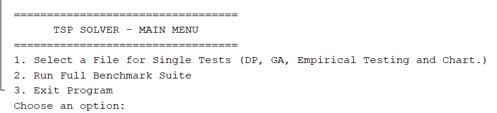
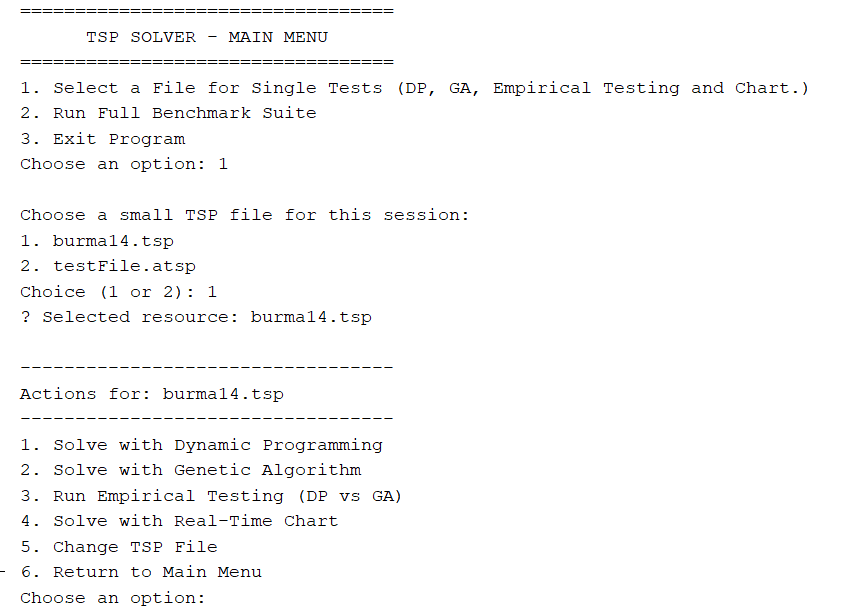
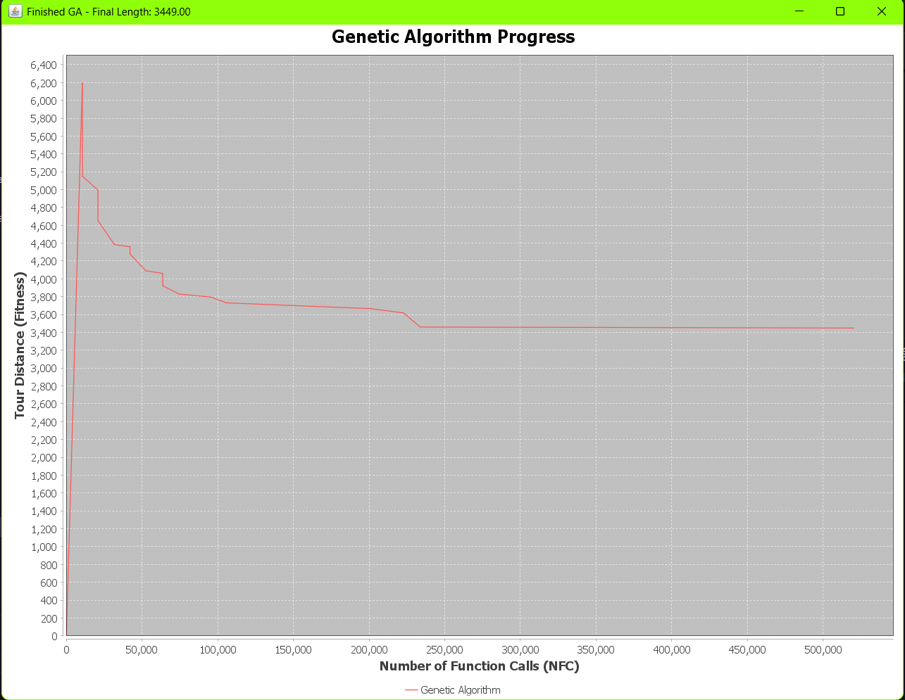
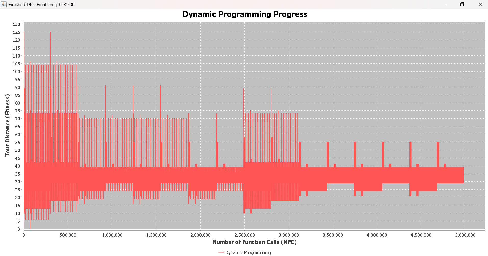
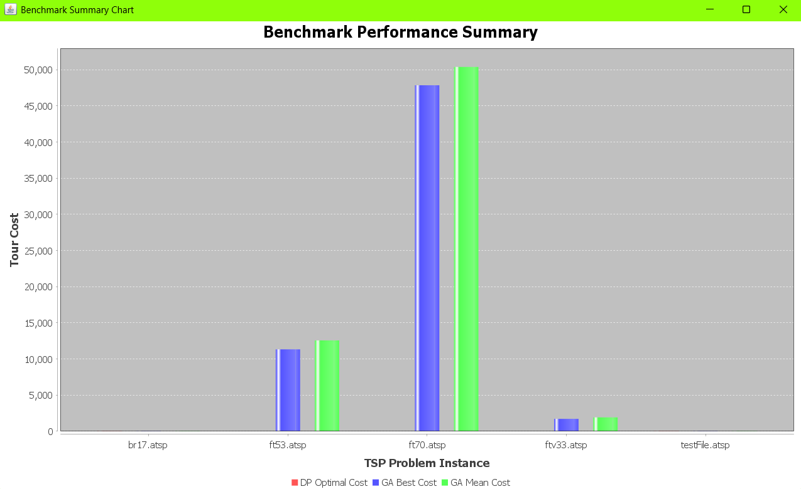

# CS214 — Assignment II: Traveling Salesman Problem Solver

Programmers:Ronil Prasad (S11231541)
            Shivan Prasad(S11231502)
            Praheel Kumar (S11229535)  

Course: CS214 — Design & Analysis of Algorithms  
University: The University of the South Pacific  
Date: 26 September 2025


                     Overview 

A comprehensive and extensible Java application for solving the Traveling Salesman Problem (TSP) using various algorithms. This project features a command-line interface (CLI) for user interaction[...]

                    Table of Content
- Features
- Core Concepts & Design
- Project Structure
- Sample Images
- Getting Started
  - Dependencies
- Usage
  - Main Menu
  - Single File Testing
  - Full Benchmark Suite
- File Formats Supported
- Credits & References


                        Features 

                Multiple Solver Algorithms:
Dynamic Programming (Held-Karp): An exact algorithm that guarantees the optimal solution. Best suited for smaller TSP instances (n < 22).

Genetic Algorithm (GA): A sophisticated heuristic solver for larger or more complex instances.

For optimal path and tour where GA = DP, the population size is: 50 and number of generation is: 200

                Extensible Algorithm Design:
The Genetic Algorithm uses the Strategy Pattern, allowing `Selection`, `Crossover`, and `Mutation` behaviors to be injected at runtime for maximum flexibility.
Includes concrete strategies like `TournamentSelection`, `OrderedCrossover`, and `SwapMutation`.

                Advanced Concurrency:
Multi-threaded benchmark runner to execute tests for multiple files in parallel.
Parallelized fitness evaluation within the Genetic Algorithm to leverage multi-core processors.
Concurrent execution of empirical test runs to gather statistical data efficiently.

                Powerful Benchmarking & Analysis:
Empirical Testing: Compare DP and GA on a single file, running each multiple times to gather statistics (Best, Mean, Worst, Success Rate, Avg. NFC).
Full Benchmark Suite: Run a comprehensive benchmark across a predefined set of TSP problems, intelligently skipping DP for infeasibly large instances.

                Rich Data Visualization:
Real-Time Progress Chart: See a solver's progress live, plotting tour distance against the number of function calls (NFC).
Benchmark Summary Chart: View a final bar chart comparing the performance of DP (optimal) vs. GA (best and mean) across all benchmarked problems.

                Versatile File Parsing:
Supports multiple TSP formats, including TSPLIB coordinate-based files (`NODE_COORD_SECTION`), TSPLIB matrix-based files (`EDGE_WEIGHT_SECTION`), and simple adjacency matrices.
Correctly calculates distances for both Euclidean (`EUC_2D`) and Geographical (`GEO`) coordinate systems.

                    Core Concepts

Interface-Based Design: The `TSPSolver` interface defines a clear contract for all solving algorithms, allowing them to be used interchangeably throughout the application (Liskov Substitution Prin[...]

Inheritance & Code Reuse: The `AbstractTSPSolver` class provides shared boilerplate logic, such as Number of Function Calls (NFC) tracking and progress reporting, to all concrete solver implementa[...]

Strategy Pattern: `TSPGA` is decoupled from its specific component algorithms. New selection, crossover, or mutation techniques can be added by simply creating a new class that implements the rele[...]

Concurrency & Parallelism: The application makes extensive use of Java's `ExecutorService` to manage thread pools for performance-critical tasks, such as running benchmarks and calculating fitness[...]

Observer Pattern (via Callbacks): The `RealTimeChart` "observes" the `TSPSolver` by passing a `Consumer` callback. The solver reports its progress by invoking this callback, decoupling the algorit[...]

Encapsulation: Critical logic, like the NFC counter, is encapsulated within the `AbstractTSPSolver` and can only be incremented through a protected helper method, ensuring data integrity.

                The Project Structure

This section documents the repository layout and explains the purpose of each top-level folder and the most important files. The structure below follows common Maven conventions and highlights project-specific resources.

Top-level layout (brief):

```text
CS214/
├── .mvn/                 — Maven wrapper files (optional; keeps build consistent across machines)
├── .vscode/              — VS Code workspace settings (IDE convenience; ignored from build)
├── .idea/                — IntelliJ/IDEA project settings (IDE convenience; not required for build)
├── Developers/           — Assignment grading / developer notes (non-code resources)
├── images/               — Screenshots and charts used by this README and for documentation
├── src/                  — Source tree (main and test code and resources)
├── target/               — Build outputs (compiled classes, packaged artifacts) — generated by Maven
├── Results.csv           — Example output from benchmark runs
├── pom.xml               — Maven project configuration (dependencies, build configuration)
└── Readme.md             — This file
```

Detailed src layout (Maven standard):

```text
src/
├── main/
│   ├── java/org/example/
│   │   ├── App.java               — Main entry point; CLI menu and program orchestration
│   │   ├── TSPSolver.java         — Solver interface; public contract for all solver implementations
│   │   ├── AbstractTSPSolver.java — Abstract base with shared utilities (NFC tracking, progress callbacks)
│   │   ├── TSPDP.java             — Dynamic Programming (Held–Karp) exact solver
│   │   ├── TSPGA.java             — Genetic Algorithm implementation and strategy interfaces
│   │   ├── TSPParser.java         — File parsing utility that detects TSPLIB and matrix formats
│   │   ├── BenchmarkRunner.java   — Orchestrates full benchmark suite and parallel execution
│   │   ├── EmpiricalTesting.java  — Runs repeated experiments (statistics collection) for a single instance
│   │   ├── RealTimeChart.java     — Small wrapper that produces real-time charts (JFreeChart integration)
│   │   └── PrintResults.java      — DTO / helper used to format and print results
│   └── resources/
│       ├── burma14.tsp
│       ├── br17.tsp
│       ├── ftv33.tsp
│       ├── ft53.atsp
│       ├── ft70.atsp
│       └── testFile.atsp
└── test/
    └── java/org/example/
        └── AppTest.java           — Unit tests (JUnit) covering core behaviours
```

Notes about build and outputs:

- target/ contains compiled classes and packaged test resources after running `mvn package` or `mvn test`.
- Do not commit build artifacts from `target/` to version control. They are included here only for completeness.

IDE and development tips:

- Import the project as a Maven project in IntelliJ IDEA or VS Code (use the Java and Maven extensions).
- Use the Maven wrapper (`./mvnw` / `mvnw.cmd`) if present to ensure consistent Maven version.
- Run unit tests with `mvn test` and build with `mvn clean package`.

Packaging and resources:

- Images used in the README and runtime charts are stored in `/images/` and referenced by relative paths.
- Example TSP files live in `src/main/resources/` so they are packaged onto the classpath and can be loaded with `ClassLoader.getResourceAsStream(...)`.

Checklist for contributors:

- Keep the `src/main/java/org/example` package focused on algorithm and runner logic.
- Add unit tests under `src/test/java` for any new behaviour.
- Update README and `Results.csv` when adding new benchmark cases or changing output format.
- Do not add large data files to the repository; if required, add them to `src/main/resources` or provide a script to download them.


                  Sample Images 

The application is controlled through a simple and intuitive CLI menu system.





            Real Time Chart Progression Example

Visualize the Genetic Algorithm's convergence towards a solution in real-time.



Visualize the Dynamic Programming flatuactuation towards a solution in real-time.



                Benchmark Summary Chart

Compare the final results of the benchmark suite with a summary bar chart.




            Getting Started with the program

Open the project in an IDE preferably - VS Code/Intellij/ Netbeans.
Refresh the pom.xml file to download all dependencies.
Run the main class corresponding to the task you wish to execute (Refer to Structure section for detailed View).

                        Dependencies

Java 17+
Maven 3.8+
JFreeChart 1.5.4
JCommon 1.0.24
JUnit 4.13.2 (for testing)

                    Usage
                    Main Menu
Once the application is running, you will be presented with the main menu.


1. Select a File for Single Tests: This option lets you choose a TSP file (`burma14.tsp` or `testFile.atsp`) and then proceed to a sub-menu of actions for that specific file.
2. Run Full Benchmark Suite: This automatically runs a comprehensive performance test on a predefined list of TSP files and displays a summary table and chart.
3. Exit Program: Terminates the application.

                Single File Testing
After selecting a file, you can perform the following actions:

1. Solve with Dynamic Programming: Runs the exact Held-Karp algorithm.
2. Solve with Genetic Algorithm: Runs the heuristic GA. You will be asked for population size and number of generations.
3. Run Empirical Testing: Compares DP vs GA over 30 runs and prints the statistical results.
4. Solve with Real-Time Chart: Solves with either DP or GA and displays the live progress chart.

                Full Benchmark Suite

This option requires no further input. It will:
1.  Run benchmarks in parallel for `testFile.atsp`, `br17.atsp`,`ftv33.atsp`,`ft53.atsp`, and `ft70.atsp`.
2.  Print a detailed summary table to the console.
3.  Display a final bar chart comparing the results.

                File Formats Supported

The `TSPParser` can automatically detect and parse the following formats:

1. TSPLIB Coordinate Format: Files with a `NODE_COORD_SECTION` and `EDGE_WEIGHT_TYPE` of `EUC_2D` or `GEO`.
2. TSPLIB Full Matrix Format: Files with an `EDGE_WEIGHT_SECTION` containing an explicit distance matrix.
3. Simple Matrix Format: A custom format where the first line is the dimension `N`, followed by `N` lines of `N` space or comma-separated distance values.

                Credits & References
1. Dynamic Programming source - Tran, H.L. and Duong, M.P., 2024. Approach to Travelling Salesman Problem using Dynamic Programming and Branch-and-Bound technique. Research proposal. University o[...]
2. Genetic Algorithm source - Li, H., 2025. Solving the TSP Problem Based on Improved Genetic Algorithm. Proceedings of the 5th International Conference on Signal Processing and Machine Learning.[...]
3. Gemini - AI model by Google. Used as coding partner.
4. GitHub Copilot - Plugin for VS Code. Used for generating methods.
